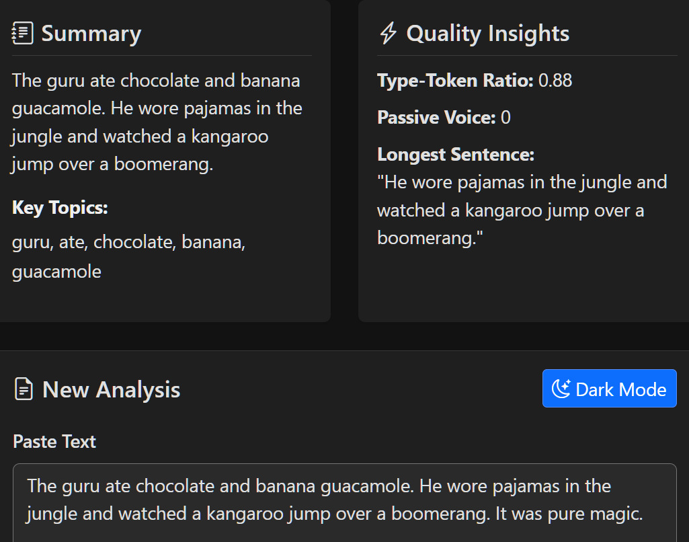
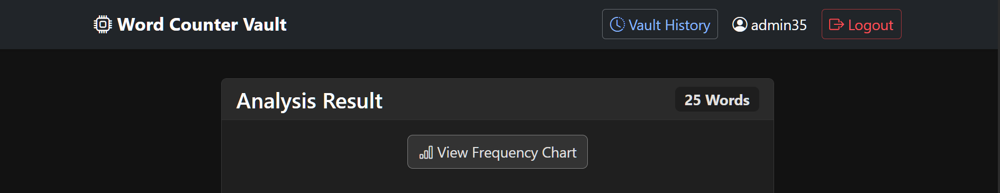
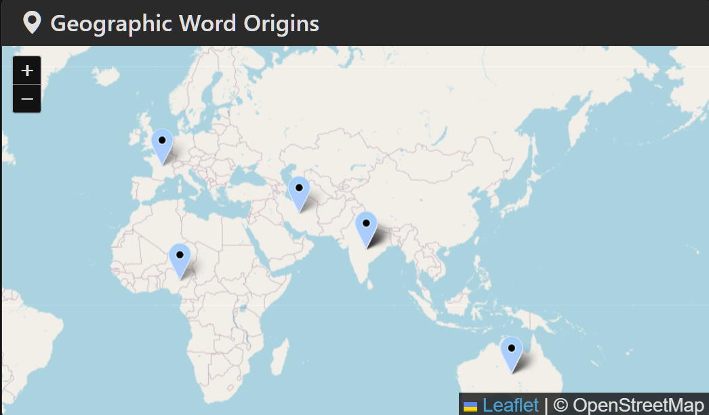
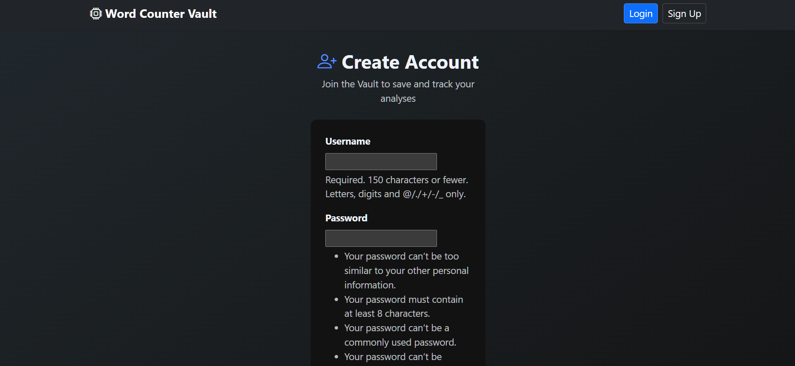
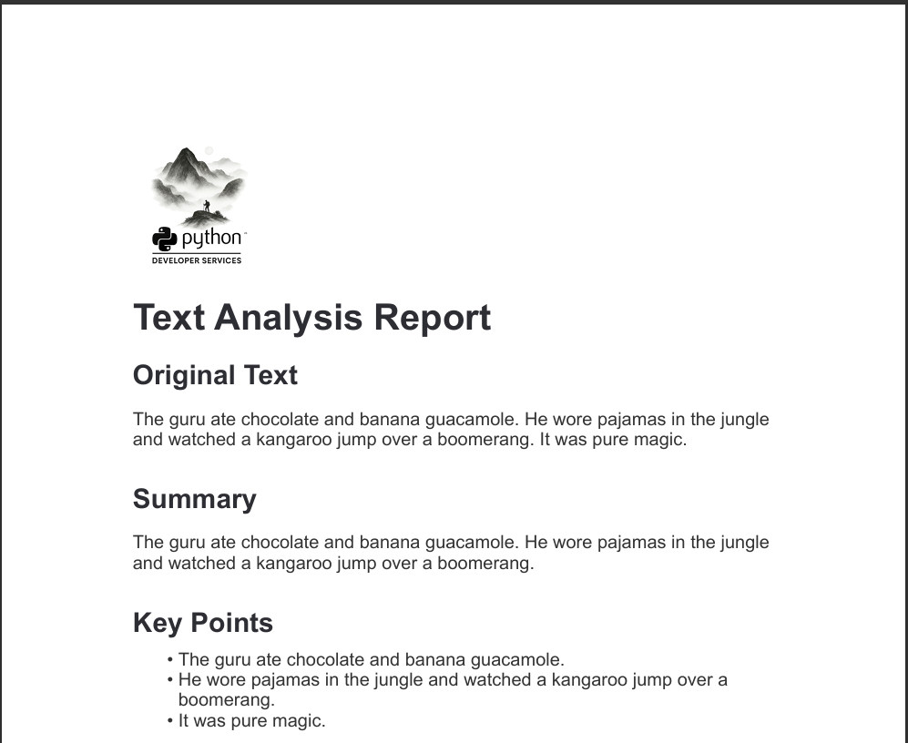
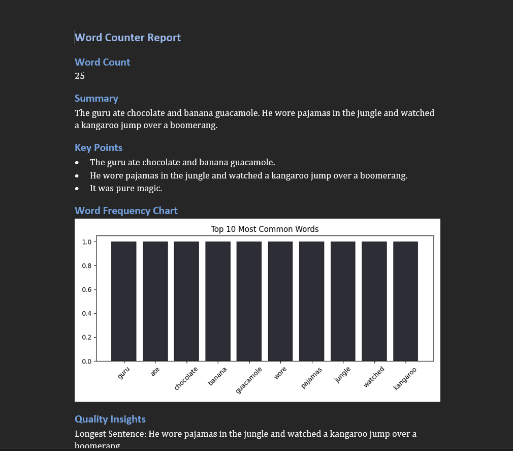
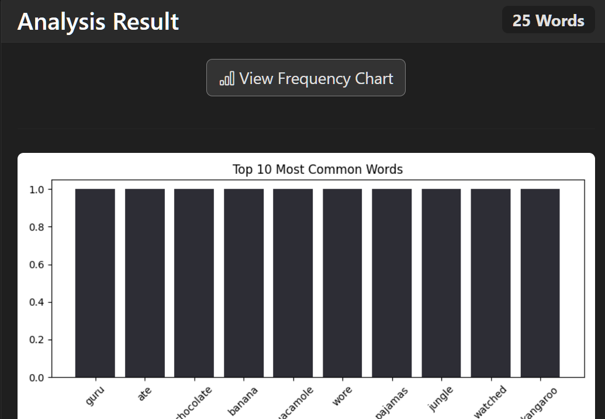
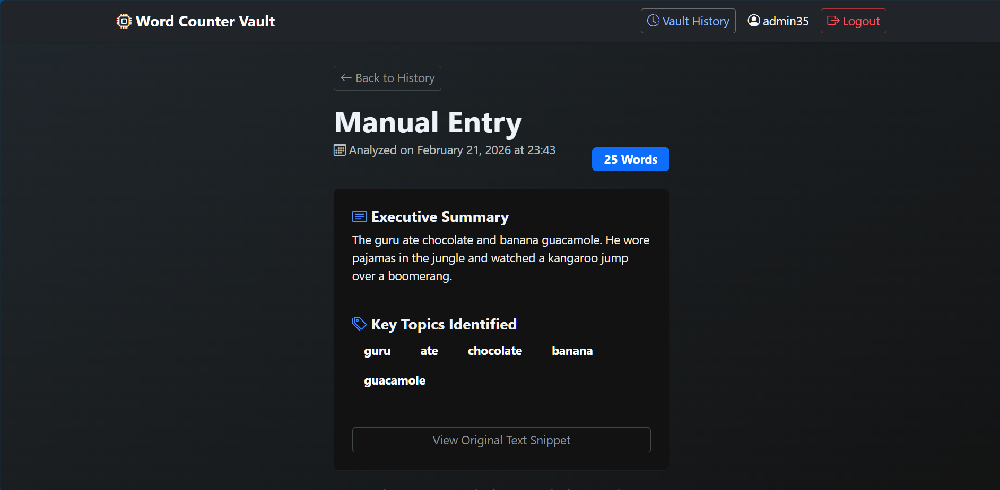
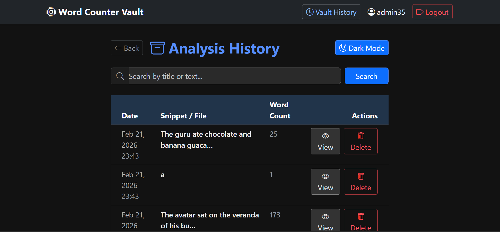

# 📚 Word Counter Vault — Full-Stack Linguistic Analysis Suite

An interactive intelligence dashboard and automated reporting tool built to analyze linguistic patterns and global etymology. This project transforms raw text input into actionable forensic insights using a modern Python stack.

## 🚀 Live Demo

*Click the badge above to view the full walkthrough of the Word Counter Vault.*

## 📸 Screenshots
See the full gallery here:

## 🛠️ Project Architecture
This project is divided into two main components to balance real-time user interaction with deep-dive analytical processing:

### 1. Interactive Analysis Dashboard (`views.py` & `templates/`)
The **"Frontend"** logic of the project. It provides a real-time interface for users to explore their text data.
* **Dynamic Geospatial Mapping:** Visualizes the "geographic DNA" of a text by pinpointing word origins across a global map using **Folium**.
* **Instant Linguistic KPIs:** Calculates Lexical Diversity (TTR), Overused Words, and Passive Voice detection on the fly.
* **User Vault:** A persistent history system allowing users to search, review, and manage their analysis records securely.

### 2. Forensic Reporting & Data Engine (`services/` & `models.py`)
The **"Analytical Backend."** This handles the heavy lifting of data management and document generation.
* **Dual-State Storage:** Manages persistent user history in **SQLite** while offloading high-speed etymological lookups to a **DuckDB** OLAP engine.
* **Global Etymology Pipeline:** A custom ingestion layer that maps over 500+ words to global coordinates (Latin, Germanic, Arabic, Sanskrit, and more).
* **Automated Document Generation:** Compiles findings into professional PDF reports (via **WeasyPrint**) and Word documents (**python-docx**) for offline review.

## 📁 File Structure
* `word_counter/settings.py`: Core configuration for the Django environment.
* `counter/views.py`: Logic for text processing, regex normalization, and dashboard rendering.
* `counter/services/seed_origins.py`: Data pipeline script for ingesting the global word library.
* `counter/services/word_data.json`: The "Source of Truth" containing 500+ global etymology records.
* `word_vault_analytics.duckdb`: High-performance database for geospatial word lookups.

## 🧰 Tech Stack
* **Python 3.10** (Development Environment)
* **Django 5.2:** For the web framework and user authentication.
* **DuckDB:** For high-performance, local analytical etymology queries.
* **SQLite:** For persistent user history and session management.
* **Folium/Leaflet:** For interactive geospatial mapping.
* **WeasyPrint / python-docx:** For automated forensic report creation.
* **Regex:** For high-speed text normalization and cleaning.

## ⚙️ Installation & Local Usage
To run this project locally:
1. **Clone the repo:** `git clone https://github.com/yourusername/word-counter-vault.git`
2. **Install dependencies:** `pip install -r requirements.txt`
3. **Seed the Global Vault:** `python -m counter.services.seed_origins`
4. **Launch the app:** `python manage.py runserver`

## 🙏 Acknowledgments
* **Etymology Sources:** Online Etymology Dictionary for root-word tracking.
* **Community:** Thanks to the Django and DuckDB communities for the robust library support.
* **Testing:** Pytest Coming soon 😁

## ⚖️ License
This project is licensed under the MIT License - see the `LICENSE` file for details.
